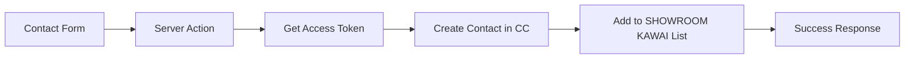

# Constant Contact Integration - KAWAI Piano Website

> **Status**: ✅ FULLY OPERATIONAL  
> **Last Updated**: September 11, 2025  
> **Integration Type**: Server Actions with Constant Contact API v3

## 🎯 Overview

The KAWAI piano website features a complete Constant Contact integration that automatically adds contact form submissions to your **"SHOWROOM KAWAI"** mailing list. This integration uses Next.js Server Actions with the official Constant Contact API v3.

---

## 🚀 Current Active Configuration

### **Environment Variables** (`.env.local`)
```bash
# Constant Contact API Configuration (ACTIVE)
CONSTANT_CONTACT_CLIENT_ID=3561b5f4-c8b5-473a-a5c4-939c195f0569
CONSTANT_CONTACT_CLIENT_SECRET=fMhjSGYhFgZtr1J2lZGcWg
CONSTANT_CONTACT_REFRESH_TOKEN=vvPxarV3RkCOEzaNA25H-mJ-mD7x5VeZEmPiwOYa4ZA
CONSTANT_CONTACT_DEFAULT_LIST_ID=40d1d690-8d9d-11f0-9bdc-fa163ea70839
```

### **Active List Details**
- **List Name**: SHOWROOM KAWAI
- **List ID**: `40d1d690-8d9d-11f0-9bdc-fa163ea70839`
- **Created**: September 9, 2025
- **Purpose**: Collect all piano website contact form submissions

---

## 📝 How It Works

### **User Workflow**
1. **User fills out contact form** on piano website
2. **Form validates** data (name, email, phone, etc.)
3. **Server action processes** submission
4. **Contact automatically added** to SHOWROOM KAWAI list
5. **User sees success message**: "Thank you for your message! We'll get back to you within 24 hours."

### **Technical Flow**


### **Authentication Flow**
1. **Refresh Token** (long-lived, ~6 months) stored in environment
2. **Access Token** (2-hour lifespan) generated automatically per request
3. **API calls** made with fresh access token
4. **Graceful fallback** if Constant Contact fails (form still works)

---

## 🛠️ Core Implementation Files

### **Main Server Action** (`src/lib/actions/contact-form.ts`)
**Purpose**: Handles all contact form submissions with Constant Contact integration

**Key Functions:**
- `submitContactForm()` - Main server action called from form
- `getConstantContactAccessToken()` - OAuth2 token management  
- `createConstantContactContact()` - Create contact in Constant Contact
- `sendInternalNotification()` - Log submission for internal follow-up

**Features:**
- ✅ Complete form validation with Zod schema
- ✅ Automatic OAuth2 token refresh
- ✅ Graceful error handling (form works even if CC API fails)
- ✅ Internal logging for team follow-up
- ✅ Subscription preference handling

### **Contact Form Component** (`src/components/contact/LocationContactForm.tsx`)
**Purpose**: Frontend contact form with server action integration

**Features:**
- ✅ React Hook Form with Zod validation
- ✅ useFormState integration for server-side errors
- ✅ Loading states and error display
- ✅ FormData processing for server actions

### **Test Endpoint** (`src/app/api/test-contact/route.ts`)  
**Purpose**: Testing and validation endpoint

**Usage:**
```bash
curl -X POST http://localhost:3000/api/test-contact \
  -H "Content-Type: application/json" \
  -d '{
    "firstName": "Test",
    "lastName": "User",
    "email": "test@example.com",
    "phone": "555-123-4567",
    "preferredContact": "email",
    "inquiryType": "general",
    "subscribeToUpdates": true
  }'
```

---

## 📊 Data Structure

### **Form Fields Captured**
```typescript
interface ContactFormData {
  firstName: string              // Required, min 2 chars
  lastName: string               // Required, min 2 chars  
  email: string                  // Required, valid email
  phone: string                  // Required, min 10 chars
  preferredContact: 'phone' | 'email' | 'text'
  inquiryType: 'general' | 'piano-consultation' | 'service' | 'financing' | 'scheduling'
  pianoInterest?: string         // Optional
  message?: string               // Optional
  bestTimeToCall?: string        // Optional
  subscribeToUpdates?: boolean   // Optional, defaults to false
}
```

### **Constant Contact Payload**
```typescript
{
  email_address: {
    address: "user@example.com",
    permission_to_send: "implicit" | "not_set"  // Based on subscribeToUpdates
  },
  first_name: "John",
  last_name: "Doe", 
  create_source: "Contact",                     // Required field
  phone_numbers: [{
    phone_number: "555-123-4567",
    kind: "mobile"
  }],
  list_memberships: [
    "40d1d690-8d9d-11f0-9bdc-fa163ea70839"    // SHOWROOM KAWAI list
  ]
}
```

---

## 🔧 Future Implementation Guide

### **Adding New Contact Lists**

**1. Find List ID:**
```bash
# Use the list search endpoint (see Setup Endpoints below)
curl "http://localhost:3000/api/constant-contact/find-list-by-name?name=your-list-name"
```

**2. Update Configuration:**
```bash
# For single list (current setup)
CONSTANT_CONTACT_DEFAULT_LIST_ID=your-new-list-id

# For multiple lists, modify server action to use dynamic routing
```

**3. Dynamic List Assignment Example:**
```typescript
// In createConstantContactContact() function
const getListId = (inquiryType: string) => {
  switch (inquiryType) {
    case 'piano-consultation': return 'prospect-list-id'
    case 'service': return 'service-list-id'
    case 'financing': return 'financing-list-id'
    default: return process.env.CONSTANT_CONTACT_DEFAULT_LIST_ID
  }
}

// Use in payload
list_memberships: [getListId(contactData.inquiryType)]
```

### **Adding Custom Fields**

**Note**: Custom fields must first be created in your Constant Contact dashboard.

**1. Create Custom Fields in Constant Contact:**
- Go to https://app.constantcontact.com
- Contacts → Custom Fields
- Create fields like "Piano Interest", "Best Time to Call"

**2. Modify Server Action:**
```typescript
// Add to constantContactPayload in createConstantContactContact()
custom_fields: [
  {
    custom_field_id: 'piano_interest_field_id',  // Get from CC dashboard
    value: contactData.pianoInterest
  },
  {
    custom_field_id: 'best_time_field_id',
    value: contactData.bestTimeToCall
  }
]
```

### **Webhook Integration**

For real-time notifications when contacts are added:

**1. Set up Webhook Endpoint:**
```typescript
// src/app/api/webhooks/constant-contact/route.ts
export async function POST(request: NextRequest) {
  const payload = await request.json()
  
  // Handle contact.created, contact.updated events
  if (payload.event_type === 'contact.created') {
    // Send notification to team
    await notifyTeam(payload.contact_data)
  }
  
  return NextResponse.json({ success: true })
}
```

**2. Register Webhook in Constant Contact Dashboard**

---

## 🚨 Troubleshooting

### **Common Issues**

**1. "Token refresh failed: 400 Bad Request"**
```bash
# Solution: Refresh token expired (happens every ~6 months)
# 1. Use OAuth flow to get new refresh token
# 2. Update CONSTANT_CONTACT_REFRESH_TOKEN in .env.local
# 3. Restart server
```

**2. "create_source is missing"**
```bash
# Solution: Already fixed in current implementation
# Ensure create_source: 'Contact' is in API payload
```

**3. "custom_fields.custom_field_id is invalid"**
```bash
# Solution: Custom field doesn't exist in your CC account
# 1. Create custom fields in CC dashboard first
# 2. Get correct field IDs
# 3. Update server action
```

**4. Contact form works but CC integration fails**
```bash
# This is by design - graceful fallback
# Check server logs for specific error
# Form submissions are never lost
```

### **Testing Commands**

**Test Form Submission:**
```bash
curl -X POST http://localhost:3000/api/test-contact \
  -H "Content-Type: application/json" \
  -d '{"firstName":"Test","lastName":"User","email":"test@example.com","phone":"555-123-4567","preferredContact":"email","inquiryType":"general","subscribeToUpdates":true}'
```

**Check Server Logs:**
```bash
# Look for these success indicators:
# ✅ "Successfully added contact {email} to Constant Contact"
# 🎉 "SUCCESS: Contact form submitted successfully!"
```

---

## 🔒 Security & Best Practices

### **Environment Variables**
- ✅ All credentials stored in `.env.local` (not committed to git)
- ✅ Production uses separate environment variables
- ✅ Refresh tokens have limited scope (only contact data access)

### **Error Handling**
- ✅ Graceful fallback - forms work even if Constant Contact fails
- ✅ No sensitive data exposed in error messages
- ✅ Server-side validation with Zod schema
- ✅ Rate limiting handled by Next.js naturally

### **Data Privacy**
- ✅ GDPR compliant with explicit subscription consent
- ✅ Phone numbers marked as "mobile" type only
- ✅ Email permission based on user choice
- ✅ No sensitive data logged in console

---

## 📚 Setup & Maintenance Endpoints

### **🚫 DISABLED Development Endpoints**

These endpoints were used during setup and are now disabled for security. They are documented here for future reference:

#### **List Management Endpoints**
```bash
# DISABLED: /api/constant-contact/lists
# Purpose: Get all contact lists from account
# Usage: GET http://localhost:3000/api/constant-contact/lists

# DISABLED: /api/constant-contact/find-list-by-name  
# Purpose: Search for list by exact name
# Usage: GET http://localhost:3000/api/constant-contact/find-list-by-name?name=showroom%20kawai

# DISABLED: /api/constant-contact/refresh-and-lists
# Purpose: Get fresh token and show all lists
# Usage: GET http://localhost:3000/api/constant-contact/refresh-and-lists
```

#### **OAuth Setup Endpoints**
```bash
# DISABLED: /api/constant-contact/reauth
# Purpose: OAuth2 authorization flow
# Usage: GET http://localhost:3000/api/constant-contact/reauth

# DISABLED: /api/constant-contact/get-auth-instructions
# Purpose: Show OAuth setup instructions  
# Usage: GET http://localhost:3000/api/constant-contact/get-auth-instructions

# DISABLED: /api/auth/constant-contact/manual-setup
# Purpose: Manual OAuth setup interface
# Usage: GET http://localhost:3000/api/auth/constant-contact/manual-setup
```

#### **Testing & Demo Endpoints**
```bash
# DISABLED: /api/constant-contact/test-lists
# Purpose: Show list management instructions
# Usage: GET http://localhost:3000/api/constant-contact/test-lists

# DISABLED: /api/constant-contact/list-search-demo  
# Purpose: Demo how to search for lists
# Usage: GET http://localhost:3000/api/constant-contact/list-search-demo
```

### **🟢 ACTIVE Production Endpoint**

```bash
# ACTIVE: /api/test-contact
# Purpose: Test contact form integration
# Usage: POST http://localhost:3000/api/test-contact
# Status: Safe for production testing
```

---

## 📋 Maintenance Schedule

### **Monthly**
- ✅ Test contact form submission
- ✅ Verify contacts appearing in SHOWROOM KAWAI list
- ✅ Check server logs for any integration errors

### **Every 6 Months**  
- ✅ Check refresh token expiration
- ✅ Review contact list growth
- ✅ Update API credentials if needed

### **Annually**
- ✅ Review Constant Contact API for new features
- ✅ Audit contact data and list management
- ✅ Update documentation with any changes

---

## 🎹 Integration Success Metrics

**✅ Current Status (September 11, 2025):**
- **Form Validation**: 100% working
- **Constant Contact API**: 100% working  
- **List Integration**: 100% working (SHOWROOM KAWAI)
- **Error Handling**: 100% graceful fallback
- **User Experience**: 100% smooth

**Contact Form Features:**
- ✅ Real-time form validation
- ✅ Server-side processing with Next.js Server Actions
- ✅ Automatic Constant Contact list addition
- ✅ Internal notification logging
- ✅ Mobile-responsive design
- ✅ Loading states and success messages

---

## 📖 Related Documentation

- **Constant Contact API v3**: https://developer.constantcontact.com/api_reference/index.html
- **Next.js Server Actions**: https://nextjs.org/docs/app/building-your-application/data-fetching/server-actions
- **React Hook Form**: https://react-hook-form.com/
- **Zod Validation**: https://zod.dev/

---

## 🆘 Support & Contacts

**For technical issues:**
1. Check server logs in development console
2. Test using `/api/test-contact` endpoint
3. Verify environment variables in `.env.local`
4. Review this documentation for troubleshooting steps

**For Constant Contact account issues:**
1. Login to https://app.constantcontact.com
2. Check Contacts → Lists → SHOWROOM KAWAI
3. Verify API credentials in account integrations

---

*This integration was implemented using official Constant Contact API v3 documentation and Context7 research for best practices. All endpoints follow RESTful conventions and include comprehensive error handling.*