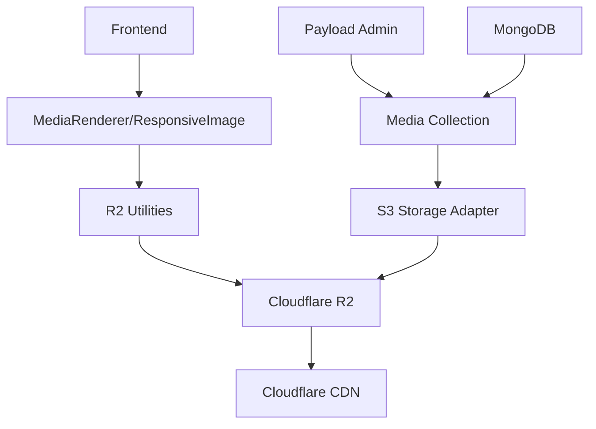

# Media System Architecture

This document describes the actual implementation of the KAWAI Piano website's media system, built with Payload CMS and Cloudflare R2 storage.

## Overview

The media system integrates Payload CMS with Cloudflare R2 for scalable media storage and delivery, optimized for high-quality piano imagery and multimedia content.

### Technology Stack
- **Backend**: Payload CMS 3.x with MongoDB
- **Storage**: Cloudflare R2 via `@payloadcms/storage-s3` adapter  
- **Frontend**: Next.js 15 with React 19
- **Optimization**: Custom R2 utilities with Cloudflare Image Resizing
- **Image Processing**: Sharp.js for server-side processing

### Key Features
- **Direct R2 URLs**: Bypasses Payload proxying with `disablePayloadAccessControl: true`
- **Custom URL Generation**: Custom `generateFileURL` function for R2 integration
- **Progressive Enhancement**: LQIP (Low Quality Image Placeholder) and lazy loading
- **Responsive Optimization**: Piano-specific presets for different contexts
- **Error Handling**: Retry logic with exponential backoff
- **Performance Monitoring**: Load time tracking and debugging utilities

## Architecture Components



## Configuration

### Environment Variables
```bash
# Database
DATABASE_URI=mongodb+srv://...
PAYLOAD_SECRET=your-secret-key

# Cloudflare R2 Configuration  
S3_ACCESS_KEY_ID=your-r2-access-key
S3_SECRET_ACCESS_KEY=your-r2-secret-key
S3_ENDPOINT=https://account-id.r2.cloudflarestorage.com
S3_BUCKET=your-bucket-name
S3_REGION=auto

# Public R2 URL for frontend access
NEXT_PUBLIC_S3_PUBLIC_URL=https://pub-subdomain.r2.dev
```

### Payload Configuration

**Location**: `src/payload.config.ts:71-108`

```typescript
import { s3Storage } from '@payloadcms/storage-s3'

s3Storage({
  collections: {
    'media': {
      prefix: 'media',
      disablePayloadAccessControl: true, // Use direct R2 URLs
      generateFileURL: ({ filename, prefix }) => {
        const publicUrl = process.env.NEXT_PUBLIC_S3_PUBLIC_URL
        if (!publicUrl) {
          throw new Error('R2 public URL not configured')
        }
        const cleanPublicUrl = publicUrl.replace(/\/$/, '')
        const path = prefix ? `${prefix}/${filename}` : filename
        return `${cleanPublicUrl}/${path}`
      },
    },
  },
  bucket: process.env.S3_BUCKET || '',
  config: {
    endpoint: process.env.S3_ENDPOINT,
    region: process.env.S3_REGION || 'auto',
    credentials: {
      accessKeyId: process.env.S3_ACCESS_KEY_ID || '',
      secretAccessKey: process.env.S3_SECRET_ACCESS_KEY || '',
    },
    forcePathStyle: true, // Required for Cloudflare R2
  },
})
```

**Key Configuration Points:**
- `forcePathStyle: true` required for R2 compatibility
- `disablePayloadAccessControl: true` for direct R2 URLs
- Custom `generateFileURL` handles URL construction
- Environment variables for security

## Media Collection

**Location**: `src/collections/Media.ts`

### Schema Implementation

```typescript
export const Media: CollectionConfig = {
  slug: 'media',
  admin: {
    group: 'Media',
    defaultColumns: ['filename', 'alt', 'mediaType', 'updatedAt'],
    useAsTitle: 'alt',
  },
  access: {
    read: () => true, // Public read access for piano website
  },
  fields: [
    // Basic Information
    { name: 'alt', type: 'text', required: true },
    { name: 'caption', type: 'text' },
    { name: 'description', type: 'textarea' },
    
    // Classification
    {
      name: 'mediaType',
      type: 'select',
      defaultValue: 'image',
      options: ['image', 'video', 'audio', 'document'],
    },
    
    // Usage Context
    {
      name: 'usage',
      type: 'select',
      hasMany: true,
      options: ['hero', 'product', 'category', 'carousel', 'background', 'thumbnail', 'technical', 'marketing'],
    },
    
    // Video Metadata (conditional)
    {
      name: 'videoMeta',
      type: 'group',
      admin: { condition: (data) => data.mediaType === 'video' },
      fields: [
        { name: 'duration', type: 'number' },
        { name: 'thumbnail', type: 'upload', relationTo: 'media' },
        { name: 'autoplay', type: 'checkbox', defaultValue: false },
        { name: 'muted', type: 'checkbox', defaultValue: true },
      ],
    },
    
    // Responsive Variants (conditional)
    {
      name: 'variants',
      type: 'group',
      admin: { condition: (data) => data.mediaType === 'image' },
      fields: [
        { name: 'mobile', type: 'upload', relationTo: 'media' },
        { name: 'tablet', type: 'upload', relationTo: 'media' },
        { name: 'desktop', type: 'upload', relationTo: 'media' },
        { name: 'largeDesktop', type: 'upload', relationTo: 'media' },
      ],
    },
    
    // SEO Metadata
    {
      name: 'seoMeta',
      type: 'group',
      fields: [
        { name: 'focusKeywords', type: 'text' },
        { name: 'photographerCredit', type: 'text' },
        { name: 'copyrightInfo', type: 'text' },
        { name: 'originalSource', type: 'text' },
      ],
    },
    
    // Organization
    { name: 'featured', type: 'checkbox', defaultValue: false },
    { name: 'tags', type: 'text', hasMany: true },
  ],
  upload: {
    staticDir: 'media',
    imageSizes: [
      { name: 'thumbnail', width: 400, height: 300, position: 'centre' },
      { name: 'card', width: 768, height: 1024, position: 'centre' },
      { name: 'tablet', width: 1024, height: undefined, position: 'centre' },
      { name: 'desktop', width: 1920, height: undefined, position: 'centre' },
    ],
    adminThumbnail: 'thumbnail',
    mimeTypes: ['image/*', 'video/*', 'audio/*', 'application/pdf'],
  },
}
```

### Enhanced Features
- **Responsive Variants**: Custom upload fields for different device sizes
- **Conditional Fields**: Video metadata only shows for video files
- **SEO Enhancement**: Additional `originalSource` field for attribution
- **Better UX**: Admin descriptions and sidebar positioning

## R2 Integration

**Location**: `src/lib/media/r2-utils.ts`

### Core Utilities

```typescript
// Environment-validated R2 URL
export const R2_PUBLIC_URL = getR2PublicUrl()

// Transformation options interface
export interface R2TransformOptions {
  width?: number
  height?: number
  quality?: number
  format?: 'webp' | 'avif' | 'jpeg' | 'png'
  fit?: 'cover' | 'contain' | 'fill' | 'inside' | 'outside'
  gravity?: 'center' | 'smart' | 'north' | 'northeast' | 'east' | 'southeast' | 'south' | 'southwest' | 'west' | 'northwest'
  dpr?: number
  blur?: number
  brightness?: number
  contrast?: number
  saturation?: number
}

// Main URL generation function
export function generateR2ImageUrl(filename: string, options: R2TransformOptions = {}): string
```

### Piano-Specific Presets

```typescript
export const PIANO_RESPONSIVE_PRESETS = {
  hero: [
    { breakpoint: 320, width: 320, quality: 75 },
    { breakpoint: 768, width: 768, quality: 80 },
    { breakpoint: 1024, width: 1024, quality: 85 },
    { breakpoint: 1440, width: 1440, quality: 90 },
    { breakpoint: 1920, width: 1920, quality: 90 }
  ],
  gallery: [
    { breakpoint: 320, width: 300, quality: 75 },
    { breakpoint: 768, width: 600, quality: 80 },
    { breakpoint: 1024, width: 800, quality: 85 },
    { breakpoint: 1440, width: 1200, quality: 85 }
  ],
  thumbnail: [
    { breakpoint: 320, width: 150, quality: 70 },
    { breakpoint: 768, width: 200, quality: 75 },
    { breakpoint: 1024, width: 250, quality: 80 }
  ],
  card: [
    { breakpoint: 320, width: 280, quality: 75 },
    { breakpoint: 768, width: 400, quality: 80 },
    { breakpoint: 1024, width: 500, quality: 85 }
  ]
}
```

### Advanced Features

**Implemented Utilities:**
- `getOptimizedImageProps()` - Complete responsive image props generation
- `generateLQIP()` - Low-quality placeholder generation
- `extractFilename()` - Smart filename extraction from various URL formats
- `getVideoProps()` - Video optimization with poster generation
- `preloadImage()` - Critical image preloading
- `batchPreloadImages()` - Batch image preloading
- `validateMediaUrl()` - URL validation for debugging
- `trackImageLoad()` - Performance monitoring
- `supportsWebP()` - Format support detection

## Frontend Components

### MediaRenderer

**Location**: `src/components/ui/media/MediaRenderer.tsx`

Universal media component with auto-detection:

```typescript
export const MediaRenderer = React.forwardRef<HTMLDivElement, MediaRendererProps>(({
  media,
  preset = 'card',
  priority = false,
  placeholder = true,
  onLoad,
  onError,
  ...props
}, ref) => {
  // Auto-detection logic
  const mediaType = typeof media === 'string' 
    ? detectTypeFromUrl(media)
    : media.mediaType || 'image'

  if (mediaType === 'video') return <VideoPlayer media={media} {...props} />
  if (mediaType === 'audio') return <AudioPlayer media={media} {...props} />
  return <ResponsiveImage media={media} preset={preset} {...props} />
})
```

**Features:**
- Auto-detection of media type from URL or object
- Error boundaries with visual feedback
- Accessibility with ARIA labels
- Debug logging in development

### ResponsiveImage

**Location**: `src/components/ui/media/ResponsiveImage.tsx`

Advanced image component with performance optimizations:

```typescript
export const ResponsiveImage = React.forwardRef<HTMLImageElement, ResponsiveImageProps>(({
  media,
  preset = 'card',
  fallback,
  placeholder = true,
  priority = false,
  // ... other props
}, ref) => {
  // Sophisticated state management
  const [isLoading, setIsLoading] = useState(true)
  const [hasError, setHasError] = useState(false)
  const [retryCount, setRetryCount] = useState(0)
  const [showLQIP, setShowLQIP] = useState(false)
  const [isIntersecting, setIsIntersecting] = useState(priority)
  
  // Implementation with advanced features
})
```

**Key Features:**
- **Lazy Loading**: Intersection Observer API with 50px root margin
- **Progressive Enhancement**: LQIP with blur effect
- **Error Handling**: Retry logic with exponential backoff (up to 2 retries)
- **Performance Tracking**: Load time monitoring
- **Next.js Integration**: Uses Next.js Image for Media objects, custom img for strings
- **Fallback Handling**: Static image detection and proper handling

### Component Integration

```tsx
// Basic usage
<MediaRenderer media={mediaItem} preset="gallery" priority={index < 3} />

// Hero with optimization
<ResponsiveImage
  media={heroImage}
  preset="hero"
  priority={true}
  aspectRatio="16/9"
  className="w-full h-screen object-cover"
/>

// Video with poster
<MediaRenderer 
  media={videoItem}
  poster={thumbnailImage}
  autoPlay={false}
  controls={true}
/>
```

## Development Workflow

### File Structure
```
src/
├── collections/
│   └── Media.ts              # Media collection schema
├── lib/
│   └── media/
│       ├── r2-utils.ts       # R2-specific utilities
│       └── types.ts          # TypeScript definitions
├── components/
│   └── ui/
│       └── media/
│           ├── MediaRenderer.tsx
│           ├── ResponsiveImage.tsx
│           └── VideoPlayer.tsx
└── payload.config.ts         # Payload configuration
```

### Adding New Media Types

1. **Update Media Collection** (`src/collections/Media.ts`):
```typescript
// Add to mediaType options
{ label: 'Interactive', value: 'interactive' }

// Add type-specific metadata
{
  name: 'interactiveMeta',
  type: 'group',
  admin: { condition: (data) => data.mediaType === 'interactive' },
  fields: [/* specific fields */],
}
```

2. **Update MediaRenderer** (`src/components/ui/media/MediaRenderer.tsx`):
```typescript
if (mediaType === 'interactive') {
  return <InteractivePlayer media={media} {...props} />
}
```

3. **Create Component**: `src/components/ui/media/InteractivePlayer.tsx`

### Testing

**R2 URL Testing:**
```typescript
const testUrl = generateR2ImageUrl('test-image.jpg', {
  width: 800,
  quality: 85,
  format: 'webp'
})
console.log('Generated URL:', testUrl)
```

**Performance Monitoring:**
```typescript
// Built-in performance tracking
trackImageLoad(filename, loadTime)

// Debug media URLs in development
debugMediaUrl(media, 'ComponentName')
```

## Performance Features

### Image Optimization
- **Format Selection**: Automatic WebP/AVIF conversion
- **Quality Adaptation**: Different quality levels by preset
- **Smart Resizing**: Piano-specific breakpoints
- **LQIP**: Progressive loading with blur effect
- **Preloading**: Critical image preloading utilities

### Caching Strategy
- **Direct R2 URLs**: Bypasses Payload for faster delivery
- **CDN Optimization**: Leverages Cloudflare's global network
- **Browser Caching**: Immutable assets with long cache headers

### Error Handling
- **Retry Logic**: Exponential backoff for failed loads
- **Fallback Images**: Graceful degradation
- **Error Boundaries**: Visual feedback for users
- **Debug Logging**: Development-time debugging

## Troubleshooting

### Common Issues
1. **Images Not Loading**: Check R2 public URL configuration and CORS
2. **Slow Loading**: Review image sizes and CDN cache hit rates  
3. **Upload Failures**: Verify S3 credentials and bucket policies

### Debug Tools
- **Environment Validation**: R2_PUBLIC_URL validation on startup
- **URL Testing**: `generateR2ImageUrl()` testing utilities
- **Performance Monitoring**: Built-in load time tracking
- **Error Logging**: Comprehensive error tracking with context

## Best Practices

### Content Strategy
- Use high-quality source images (minimum 1920px width)
- Implement proper alt text for accessibility
- Tag content appropriately for organization
- Use responsive variants for critical images

### Development
- Always use TypeScript for type safety
- Implement proper error boundaries
- Use existing presets before creating custom ones
- Monitor performance with built-in tracking tools

### Security
- Environment variables for all credentials
- Public read access appropriate for piano website
- Validate file uploads via Payload's built-in validation
- Use HTTPS for all R2 URLs

This architecture provides a production-ready, scalable media system optimized for the KAWAI Piano website's specific needs.