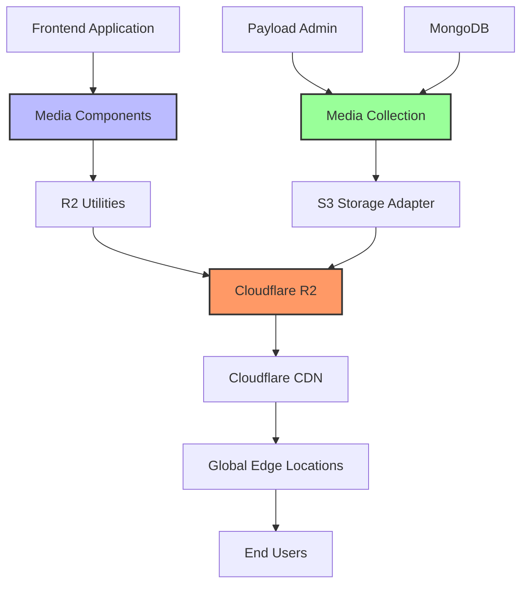

# Media System Architecture Guide

## Table of Contents
1. [Overview](#overview)
2. [Architecture Components](#architecture-components)
3. [Configuration](#configuration)
4. [Media Collection](#media-collection)
5. [Cloudflare R2 Integration](#cloudflare-r2-integration)
6. [Frontend Media Rendering](#frontend-media-rendering)
7. [Development Guide](#development-guide)
8. [Implementation Examples](#implementation-examples)
9. [Performance Optimization](#performance-optimization)
10. [Troubleshooting](#troubleshooting)
11. [Best Practices](#best-practices)

## Overview

This document provides a comprehensive guide to the media system architecture implemented in the KAWAI Piano website. The system integrates Payload CMS with Cloudflare R2 for scalable media storage and delivery, optimized for high-quality piano imagery and multimedia content.

### Key Features
- **Payload CMS Integration**: Headless CMS for media management
- **Cloudflare R2 Storage**: S3-compatible object storage with global CDN
- **Image Optimization**: On-the-fly transformations and responsive delivery
- **Performance Optimized**: Lazy loading, progressive enhancement, and caching
- **TypeScript Support**: Full type safety across the entire stack
- **SEO Optimized**: Proper metadata and structured data for media

### Technology Stack
- **Backend**: Payload CMS 3.x with MongoDB
- **Storage**: Cloudflare R2 via `@payloadcms/storage-s3` adapter
- **Frontend**: Next.js 15 with React 19
- **Optimization**: Custom R2 utilities with Cloudflare Image Resizing
- **Image Processing**: Sharp.js for server-side processing

## Architecture Components



### Component Overview

1. **Payload CMS**: Content management and media administration
2. **Media Collection**: Structured media schema with metadata
3. **S3 Storage Adapter**: Seamless integration with Cloudflare R2
4. **R2 Utilities**: Custom optimization and URL generation
5. **Media Components**: React components for rendering media
6. **CDN Delivery**: Global content delivery via Cloudflare

## Configuration

### Environment Variables

The following environment variables are required for the media system:

```bash
# Database
DATABASE_URI=mongodb://localhost:27017/kawai-cms
PAYLOAD_SECRET=your-secret-key

# Cloudflare R2 Configuration
S3_ACCESS_KEY_ID=your-r2-access-key
S3_SECRET_ACCESS_KEY=your-r2-secret-key
S3_ENDPOINT=https://your-account-id.r2.cloudflarestorage.com
S3_BUCKET=your-bucket-name
S3_REGION=auto

# Public R2 URL for frontend access
NEXT_PUBLIC_S3_PUBLIC_URL=https://pub-your-subdomain.r2.dev
```

### Payload Configuration

The main Payload configuration is located in `src/payload.config.ts`:

```typescript
import { s3Storage } from '@payloadcms/storage-s3'

export default buildConfig({
  // ... other config
  plugins: [
    s3Storage({
      collections: {
        'media': {
          prefix: 'media',
          clientUploads: process.env.NODE_ENV === 'production',
        },
      },
      bucket: process.env.S3_BUCKET || '',
      config: {
        endpoint: process.env.S3_ENDPOINT,
        region: process.env.S3_REGION || 'auto',
        credentials: {
          accessKeyId: process.env.S3_ACCESS_KEY_ID || '',
          secretAccessKey: process.env.S3_SECRET_ACCESS_KEY || '',
        },
        forcePathStyle: true, // Required for Cloudflare R2
      },
    }),
  ],
})
```

**Key Configuration Points:**
- `forcePathStyle: true` is required for R2 compatibility
- `clientUploads` enabled in production to bypass Vercel limits
- Prefix organizes files in the bucket
- Credentials use environment variables for security

## Media Collection

### Schema Definition

The media collection is defined in `src/collections/Media.ts` with comprehensive metadata fields:

```typescript
export const Media: CollectionConfig = {
  slug: 'media',
  admin: {
    group: 'Media',
    defaultColumns: ['filename', 'alt', 'mediaType', 'updatedAt'],
    useAsTitle: 'alt',
  },
  access: {
    read: () => true,
  },
  fields: [
    // Basic Media Information
    {
      name: 'alt',
      type: 'text',
      required: true,
    },
    {
      name: 'caption',
      type: 'text',
    },
    {
      name: 'description',
      type: 'textarea',
    },
    
    // Media Type Classification
    {
      name: 'mediaType',
      type: 'select',
      defaultValue: 'image',
      options: [
        { label: 'Image', value: 'image' },
        { label: 'Video', value: 'video' },
        { label: 'Audio', value: 'audio' },
        { label: 'Document', value: 'document' },
      ],
    },
    
    // Usage Context
    {
      name: 'usage',
      type: 'select',
      hasMany: true,
      options: [
        { label: 'Hero Images', value: 'hero' },
        { label: 'Product Images', value: 'product' },
        { label: 'Category Images', value: 'category' },
        { label: 'Carousel/Gallery', value: 'carousel' },
        { label: 'Background Images', value: 'background' },
        { label: 'Thumbnails', value: 'thumbnail' },
        { label: 'Technical Diagrams', value: 'technical' },
        { label: 'Marketing Materials', value: 'marketing' },
      ],
    },
    
    // Video-specific Fields
    {
      name: 'videoMeta',
      type: 'group',
      admin: {
        condition: (data) => data.mediaType === 'video',
      },
      fields: [
        {
          name: 'duration',
          type: 'number',
        },
        {
          name: 'thumbnail',
          type: 'upload',
          relationTo: 'media',
        },
        {
          name: 'autoplay',
          type: 'checkbox',
          defaultValue: false,
        },
        {
          name: 'muted',
          type: 'checkbox',
          defaultValue: true,
        },
      ],
    },
    
    // SEO and Technical Metadata
    {
      name: 'seoMeta',
      type: 'group',
      fields: [
        {
          name: 'focusKeywords',
          type: 'text',
        },
        {
          name: 'photographerCredit',
          type: 'text',
        },
        {
          name: 'copyrightInfo',
          type: 'text',
        },
      ],
    },
    
    // Organization
    {
      name: 'featured',
      type: 'checkbox',
      defaultValue: false,
    },
    {
      name: 'tags',
      type: 'text',
      hasMany: true,
    },
  ],
  upload: {
    staticDir: 'media',
    imageSizes: [
      {
        name: 'thumbnail',
        width: 400,
        height: 300,
        position: 'centre',
      },
      {
        name: 'card',
        width: 768,
        height: 1024,
        position: 'centre',
      },
      {
        name: 'tablet',
        width: 1024,
        height: undefined,
        position: 'centre',
      },
      {
        name: 'desktop',
        width: 1920,
        height: undefined,
        position: 'centre',
      },
    ],
    adminThumbnail: 'thumbnail',
    mimeTypes: ['image/*', 'video/*', 'audio/*', 'application/pdf'],
  },
}
```

### Field Categories

1. **Basic Information**: Alt text, captions, descriptions
2. **Classification**: Media type, usage context, tags
3. **Video Metadata**: Duration, thumbnails, playback settings
4. **SEO Data**: Keywords, credits, copyright information
5. **Organization**: Featured status, administrative tags

## Cloudflare R2 Integration

### R2 Utilities

The R2 integration is handled by custom utilities in `src/lib/media/r2-utils.ts`:

```typescript
export const R2_PUBLIC_URL = 'https://pub-your-subdomain.r2.dev'

export interface R2TransformOptions {
  width?: number
  height?: number
  quality?: number
  format?: 'webp' | 'avif' | 'jpeg' | 'png'
  fit?: 'cover' | 'contain' | 'fill' | 'inside' | 'outside'
  gravity?: 'center' | 'north' | 'northeast' | 'east' | 'southeast' | 'south' | 'southwest' | 'west' | 'northwest' | 'smart'
  dpr?: number
  blur?: number
  brightness?: number
  contrast?: number
  saturation?: number
}

export function generateR2ImageUrl(
  filename: string, 
  options: R2TransformOptions = {}
): string {
  const defaults: R2TransformOptions = {
    quality: 85,
    format: 'webp',
    fit: 'cover',
    gravity: 'smart'
  }

  const finalOptions = { ...defaults, ...options }
  const params = new URLSearchParams()

  // Build transformation parameters
  if (finalOptions.width) params.set('width', finalOptions.width.toString())
  if (finalOptions.height) params.set('height', finalOptions.height.toString())
  if (finalOptions.quality) params.set('quality', finalOptions.quality.toString())
  if (finalOptions.format) params.set('format', finalOptions.format)
  if (finalOptions.fit) params.set('fit', finalOptions.fit)
  if (finalOptions.gravity) params.set('gravity', finalOptions.gravity)

  const transformParams = params.toString()
  const baseUrl = `${R2_PUBLIC_URL}/${filename.replace(/^\//, '')}`
  
  return transformParams ? `${baseUrl}?${transformParams}` : baseUrl
}
```

### Image Transformation Features

Cloudflare R2 with Image Resizing provides:

1. **On-the-fly Resizing**: Dynamic width/height adjustment
2. **Format Optimization**: WebP/AVIF conversion for modern browsers
3. **Quality Control**: Compression optimization (1-100)
4. **Smart Cropping**: AI-powered focus detection
5. **Device Pixel Ratio**: High-DPI display support
6. **Color Adjustments**: Brightness, contrast, saturation

### Responsive Presets

Pre-configured breakpoints for different use cases:

```typescript
export const PIANO_RESPONSIVE_PRESETS = {
  hero: [
    { breakpoint: 320, width: 320, quality: 75 },
    { breakpoint: 768, width: 768, quality: 80 },
    { breakpoint: 1024, width: 1024, quality: 85 },
    { breakpoint: 1440, width: 1440, quality: 90 },
    { breakpoint: 1920, width: 1920, quality: 90 }
  ],
  
  gallery: [
    { breakpoint: 320, width: 300, quality: 75 },
    { breakpoint: 768, width: 600, quality: 80 },
    { breakpoint: 1024, width: 800, quality: 85 },
    { breakpoint: 1440, width: 1200, quality: 85 }
  ],
  
  thumbnail: [
    { breakpoint: 320, width: 150, quality: 70 },
    { breakpoint: 768, width: 200, quality: 75 },
    { breakpoint: 1024, width: 250, quality: 80 }
  ],
  
  card: [
    { breakpoint: 320, width: 280, quality: 75 },
    { breakpoint: 768, width: 400, quality: 80 },
    { breakpoint: 1024, width: 500, quality: 85 }
  ]
}
```

## Frontend Media Rendering

### Component Architecture

The frontend uses a component-based approach for media rendering:

```typescript
// Component Hierarchy
MediaRenderer (root component)
├── ResponsiveImage (for images)
├── VideoPlayer (for videos)
└── AudioPlayer (for audio)
```

### ResponsiveImage Component

The `ResponsiveImage` component provides advanced image loading features:

```typescript
export const ResponsiveImage = React.forwardRef<
  HTMLImageElement,
  ResponsiveImageProps
>(({
  media,
  preset = 'card',
  fallback,
  placeholder = true,
  aspectRatio,
  objectFit = 'cover',
  priority = false,
  className,
  onLoad,
  onError,
  ...props
}, ref) => {
  // Implementation with:
  // - Intersection Observer for lazy loading
  // - Progressive loading with LQIP
  // - Error handling with retry logic
  // - Performance tracking
})
```

**Key Features:**

1. **Lazy Loading**: Uses Intersection Observer API
2. **Progressive Enhancement**: LQIP (Low Quality Image Placeholder)
3. **Error Handling**: Automatic retry with exponential backoff
4. **Performance Monitoring**: Load time tracking
5. **Accessibility**: Proper ARIA attributes and alt text
6. **Responsive**: Automatic srcset generation

### MediaRenderer Component

The universal media renderer automatically detects media type:

```typescript
export const MediaRenderer = React.forwardRef<
  HTMLDivElement,
  MediaRendererProps
>(({
  media,
  preset = 'card',
  priority = false,
  placeholder = true,
  onLoad,
  onError,
  ...props
}, ref) => {
  // Auto-detection logic
  const mediaType = typeof media === 'string' 
    ? detectTypeFromUrl(media)
    : media.mediaType || 'image'

  if (mediaType === 'video') {
    return <VideoPlayer media={media} {...props} />
  }

  if (mediaType === 'audio') {
    return <AudioPlayer media={media} {...props} />
  }

  // Default to image
  return <ResponsiveImage media={media} preset={preset} {...props} />
})
```

### Usage Examples

```tsx
// Basic image rendering
<MediaRenderer 
  media={mediaItem} 
  preset="gallery" 
  priority={index < 3}
/>

// Hero image with custom optimization
<ResponsiveImage
  media={heroImage}
  preset="hero"
  priority={true}
  aspectRatio="16/9"
  className="w-full h-screen object-cover"
/>

// Video with custom poster
<MediaRenderer 
  media={videoItem}
  poster={thumbnailImage}
  autoPlay={false}
  controls={true}
/>
```

## Development Guide

### Setting Up the Development Environment

1. **Clone and Install Dependencies**
```bash
git clone <repository-url>
cd kawai-piano-website
npm install
```

2. **Configure Environment Variables**
```bash
cp .env.example .env.local
# Edit .env.local with your credentials
```

3. **Set Up Cloudflare R2**
   - Create R2 bucket in Cloudflare dashboard
   - Generate API tokens with appropriate permissions
   - Configure public domain for the bucket
   - Enable Image Resizing (if not already enabled)

4. **Initialize Database**
```bash
# Start MongoDB (local development)
mongod

# Run Payload in development mode
npm run dev
```

### File Structure

```
src/
├── collections/
│   └── Media.ts              # Media collection schema
├── lib/
│   ├── media.ts              # Main media utilities
│   └── media/
│       ├── r2-utils.ts       # R2-specific utilities
│       ├── hooks.ts          # Media hooks
│       └── types.ts          # TypeScript definitions
├── components/
│   └── ui/
│       └── media/
│           ├── MediaRenderer.tsx     # Universal media component
│           ├── ResponsiveImage.tsx   # Image component
│           ├── VideoPlayer.tsx       # Video component
│           └── MediaGallery.tsx      # Gallery component
└── payload.config.ts         # Payload configuration
```

### Adding New Media Types

1. **Update Media Collection Schema**
```typescript
// Add new media type option
{
  name: 'mediaType',
  type: 'select',
  options: [
    // ... existing options
    { label: 'Interactive', value: 'interactive' },
  ],
}

// Add type-specific fields
{
  name: 'interactiveMeta',
  type: 'group',
  admin: {
    condition: (data) => data.mediaType === 'interactive',
  },
  fields: [
    // Interactive-specific fields
  ],
}
```

2. **Update MediaRenderer Component**
```typescript
// Add handling for new media type
if (mediaType === 'interactive') {
  return <InteractivePlayer media={media} {...props} />
}
```

3. **Create New Component**
```typescript
// Create InteractivePlayer.tsx
export const InteractivePlayer: React.FC<InteractivePlayerProps> = ({
  media,
  ...props
}) => {
  // Implementation
}
```

### Testing Media Components

1. **Unit Testing**
```typescript
// Test responsive image generation
import { getOptimizedImageProps } from '@/lib/media/r2-utils'

describe('R2 Utils', () => {
  it('should generate correct image URLs', () => {
    const props = getOptimizedImageProps(mockMedia, 'gallery')
    expect(props.src).toContain('width=800')
    expect(props.src).toContain('quality=85')
  })
})
```

2. **Integration Testing**
```typescript
// Test media upload flow
describe('Media Upload', () => {
  it('should upload to R2 and generate thumbnails', async () => {
    const file = new File(['test'], 'test.jpg', { type: 'image/jpeg' })
    const result = await uploadMedia(file)
    expect(result.url).toContain(R2_PUBLIC_URL)
  })
})
```

## Implementation Examples

### Basic Image Gallery

```tsx
import { MediaRenderer } from '@/components/ui/media/MediaRenderer'

export const PianoGallery: React.FC<{ media: Media[] }> = ({ media }) => {
  return (
    <div className="grid grid-cols-1 md:grid-cols-2 lg:grid-cols-3 gap-6">
      {media.map((item, index) => (
        <div key={item.id} className="aspect-square overflow-hidden rounded-lg">
          <MediaRenderer
            media={item}
            preset="gallery"
            priority={index < 6} // Prioritize first 6 images
            className="w-full h-full object-cover hover:scale-105 transition-transform"
          />
        </div>
      ))}
    </div>
  )
}
```

### Hero Section with Optimized Image

```tsx
export const HeroSection: React.FC<{ heroMedia: Media }> = ({ heroMedia }) => {
  return (
    <section className="relative h-screen overflow-hidden">
      <MediaRenderer
        media={heroMedia}
        preset="hero"
        priority={true}
        className="absolute inset-0 w-full h-full object-cover"
      />
      <div className="absolute inset-0 bg-black/40" />
      <div className="relative z-10 flex items-center justify-center h-full text-white">
        <h1 className="text-6xl font-bold text-center">
          Premium Piano Collection
        </h1>
      </div>
    </section>
  )
}
```

### Dynamic Media Loading

```tsx
export const MediaCarousel: React.FC = () => {
  const [media, setMedia] = useState<Media[]>([])
  const [loading, setLoading] = useState(true)

  useEffect(() => {
    const loadMedia = async () => {
      try {
        const response = await fetch('/api/media?limit=20&sort=-createdAt')
        const data = await response.json()
        setMedia(data.docs)
      } catch (error) {
        console.error('Failed to load media:', error)
      } finally {
        setLoading(false)
      }
    }

    loadMedia()
  }, [])

  if (loading) {
    return <MediaSkeleton />
  }

  return (
    <div className="overflow-x-auto">
      <div className="flex space-x-4">
        {media.map((item) => (
          <div key={item.id} className="flex-shrink-0 w-80">
            <MediaRenderer
              media={item}
              preset="card"
              className="w-full h-60 object-cover rounded-lg"
            />
          </div>
        ))}
      </div>
    </div>
  )
}
```

## Performance Optimization

### Image Optimization Strategies

1. **Format Selection**
```typescript
// Automatic format optimization
const getOptimalFormat = (userAgent: string): string => {
  if (userAgent.includes('Chrome') || userAgent.includes('Firefox')) {
    return 'webp'
  }
  if (userAgent.includes('Safari')) {
    return 'avif' // Safari 16+ supports AVIF
  }
  return 'jpeg' // Fallback
}
```

2. **Quality Adaptation**
```typescript
// Network-aware quality selection
const getAdaptiveQuality = (effectiveType: string): number => {
  switch (effectiveType) {
    case 'slow-2g':
    case '2g':
      return 60
    case '3g':
      return 75
    case '4g':
    default:
      return 85
  }
}
```

3. **Preloading Critical Images**
```typescript
// Preload above-the-fold images
export const preloadCriticalImages = (images: string[]): void => {
  images.forEach(src => {
    const link = document.createElement('link')
    link.rel = 'preload'
    link.as = 'image'
    link.href = src
    document.head.appendChild(link)
  })
}
```

### Caching Strategy

1. **Browser Caching**
```typescript
// Set appropriate cache headers
const cacheHeaders = {
  'Cache-Control': 'public, max-age=31536000, immutable',
  'ETag': generateETag(filename),
  'Last-Modified': getLastModified(filename),
}
```

2. **CDN Configuration**
```typescript
// Cloudflare cache settings
const cloudflareConfig = {
  cacheLevel: 'aggressive',
  browserTTL: 31536000, // 1 year
  edgeTTL: 2592000,     // 30 days
  cacheKey: 'url+headers', // Include query params in cache key
}
```

### Performance Monitoring

```typescript
// Track Core Web Vitals for media
export const trackMediaPerformance = (element: HTMLImageElement) => {
  const observer = new PerformanceObserver((list) => {
    list.getEntries().forEach((entry) => {
      if (entry.name.includes(element.src)) {
        console.log(`Image load time: ${entry.duration}ms`)
        // Send to analytics
        gtag('event', 'image_load', {
          duration: entry.duration,
          src: entry.name,
        })
      }
    })
  })
  
  observer.observe({ entryTypes: ['resource'] })
}
```

## Troubleshooting

### Common Issues

1. **Images Not Loading**
   - Check R2 bucket permissions
   - Verify CORS configuration
   - Confirm public domain setup
   - Validate environment variables

2. **Slow Loading Times**
   - Review image sizes and compression
   - Check CDN cache hit rates
   - Optimize image formats
   - Implement proper lazy loading

3. **Upload Failures**
   - Verify S3 credentials
   - Check bucket policies
   - Confirm endpoint URLs
   - Review file size limits

### Debug Tools

1. **R2 URL Testing**
```typescript
// Test R2 URL generation
const testUrl = generateR2ImageUrl('test-image.jpg', {
  width: 800,
  quality: 85,
  format: 'webp'
})
console.log('Generated URL:', testUrl)
```

2. **Performance Monitoring**
```typescript
// Monitor image load performance
const observer = new PerformanceObserver((list) => {
  list.getEntries().forEach((entry) => {
    console.log(`Resource: ${entry.name}, Duration: ${entry.duration}ms`)
  })
})
observer.observe({ entryTypes: ['resource'] })
```

3. **Error Logging**
```typescript
// Comprehensive error tracking
const logMediaError = (error: Error, context: string) => {
  console.error(`Media Error [${context}]:`, error)
  
  // Send to error tracking service
  if (typeof window !== 'undefined') {
    window.gtag?.('event', 'exception', {
      description: error.message,
      fatal: false,
      context,
    })
  }
}
```

## Best Practices

### Content Strategy

1. **Image Guidelines**
   - Use high-quality source images (minimum 1920px width)
   - Maintain consistent aspect ratios for product images
   - Implement proper alt text for accessibility
   - Optimize for mobile-first viewing

2. **File Organization**
   - Use descriptive filenames
   - Implement consistent naming conventions
   - Organize by category/collection
   - Tag content appropriately

3. **SEO Optimization**
   - Include relevant keywords in alt text
   - Use descriptive filenames
   - Implement structured data for images
   - Optimize for Core Web Vitals

### Development Guidelines

1. **Code Organization**
   - Keep media utilities modular
   - Use TypeScript for type safety
   - Implement proper error boundaries
   - Follow React best practices

2. **Performance**
   - Implement lazy loading by default
   - Use appropriate image formats
   - Optimize bundle size
   - Monitor Core Web Vitals

3. **Security**
   - Validate file uploads
   - Implement proper access controls
   - Use environment variables for secrets
   - Regular security audits

### Deployment Considerations

1. **Environment Setup**
   - Configure production environment variables
   - Set up monitoring and alerting
   - Implement backup strategies
   - Test disaster recovery procedures

2. **Monitoring**
   - Track performance metrics
   - Monitor error rates
   - Set up uptime monitoring
   - Implement logging strategies

This documentation provides a comprehensive guide for developing, implementing, and maintaining the media system architecture. Regular updates should be made as the system evolves and new features are added.