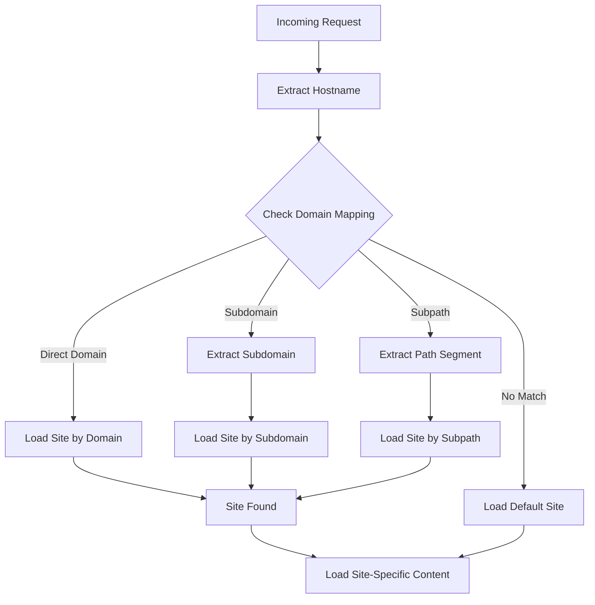
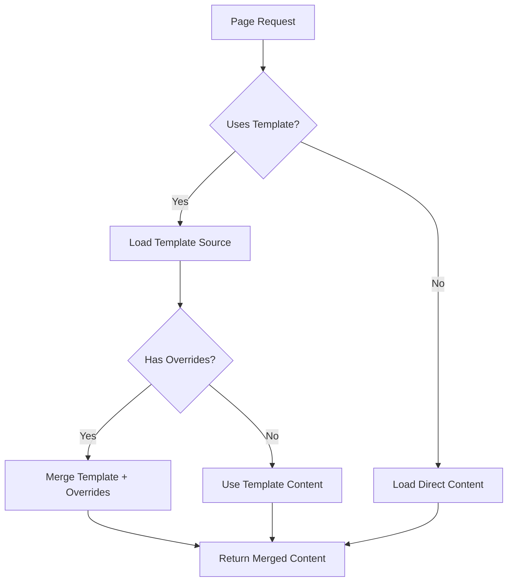

# KAWAI Multi-Site System Documentation

> A comprehensive guide to the KAWAI Piano multi-site content management system built with Payload CMS 3.52+

## Table of Contents

1. [System Overview](#system-overview)
2. [Architecture](#architecture)
3. [Collections Reference](#collections-reference)
4. [Template Inheritance System](#template-inheritance-system)
5. [User Roles & Permissions](#user-roles--permissions)
6. [Site Configuration](#site-configuration)
7. [API Endpoints](#api-endpoints)
8. [Development Guide](#development-guide)
9. [Deployment & Migration](#deployment--migration)
10. [Maintenance & Troubleshooting](#maintenance--troubleshooting)
11. [Best Practices](#best-practices)

---

## System Overview

The KAWAI Multi-Site System enables management of multiple piano showroom locations through a single Payload CMS instance. Each location can have customized content while sharing common resources and templates.

### Key Features

- **Multi-Site Management**: Centralized control of multiple showroom locations
- **Template Inheritance**: Share content across sites with selective overrides
- **Role-Based Access**: Site-specific user permissions and content access
- **Flexible Content**: Location-specific customization of pages, categories, and features
- **SEO Optimization**: Site-specific meta data and structured content
- **Scalable Architecture**: Easy addition of new locations

### Core Components

```
Sites Collection ──┐
                   ├── SitePages Collection (Template Inheritance)
                   ├── Users Collection (Site-Based Roles)
                   ├── PianoModels Collection (Site Availability)
                   └── Site Detection Middleware (Domain Routing)
```

---

## Architecture

### Data Hierarchy

```
Users (Authentication & Permissions)
  └── Sites (Location Management)
      ├── SitePages (Content Management)
      │   ├── Template Inheritance
      │   └── Page Types (pianos, home, about, contact, etc.)
      ├── PianoModels (Inventory & Availability)
      └── Media (Shared Assets)
```

### Site Resolution Flow



### Template Inheritance Flow



---

## Collections Reference

### Sites Collection (`sites`)

**Purpose**: Manages individual showroom locations and their configurations.

#### Core Fields

| Field | Type | Description |
|-------|------|-------------|
| `name` | Text | Site display name (e.g., "Kawai Piano Gallery Houston") |
| `slug` | Text | URL-friendly identifier (e.g., "houston") |
| `status` | Select | Site status: active, coming-soon, maintenance, inactive |
| `isDefault` | Checkbox | Fallback site for unmatched domains |

#### Domain Configuration

| Field | Type | Description |
|-------|------|-------------|
| `domain` | Text | Primary domain (e.g., "kawaihouston.com") |
| `subdomain` | Text | Subdomain prefix (e.g., "houston" for houston.kawai.com) |
| `subpath` | Text | URL subpath (e.g., "houston" for kawai.com/houston) |
| `alternativeDomains` | Array | Additional domains that resolve to this site |
| `redirects` | Array | URL redirect rules with 301/302 support |

#### Location Details

| Field Group | Fields | Description |
|-------------|--------|-------------|
| `address` | street, city, state, zipCode, coordinates | Physical location information |
| `contact` | phone, email, hours[], socialMedia[] | Contact information and business hours |

#### Branding & Customization

| Field Group | Fields | Description |
|-------------|--------|-------------|
| `branding` | logo, colors, fonts, customCSS | Site-specific visual customization |
| `features` | enableInventory, enablePricing, etc. | Feature toggles per site |
| `seo` | metaTitle, metaDescription, analytics IDs | SEO and tracking configuration |

#### Access Control

- **Read**: Public access
- **Create**: Super-admin only
- **Update**: Super-admin or site administrators
- **Delete**: Super-admin only

#### API Endpoints

```typescript
// Get site by domain
GET /api/sites/by-domain/:domain

// Get default site
GET /api/sites/default
```

### SitePages Collection (`site-pages`)

**Purpose**: Manages site-specific pages with template inheritance capabilities.

#### Core Fields

| Field | Type | Description |
|-------|------|-------------|
| `site` | Relationship | Reference to Sites collection |
| `pageType` | Select | Page type: pianos, home, about, contact, services, custom |
| `title` | Text | Internal page title for admin reference |
| `status` | Select | Publication status: draft, published, archived |

#### Template Inheritance System

| Field Group | Fields | Description |
|-------------|--------|-------------|
| `templateSettings` | useTemplate, templateSource, isTemplate | Template configuration |
| `overrideFields` | Array of field paths to override | Selective template overrides |

#### Content Fields by Page Type

##### Pianos Page (`pageType: 'pianos'`)

| Tab | Fields | Description |
|-----|--------|-------------|
| Hero Section | `heroContent.*` | Page header with title, description, CTA |
| Piano Categories | `pianoCategories[]` | Site-specific piano category configuration |
| Featured Models | `featuredModelsSection`, `featuredModels[]` | Carousel of featured instruments |
| Call to Action | `ctaSection.*` | Bottom section encouraging showroom visits |
| SEO & Meta | `seo.*` | Site-specific SEO optimization |

##### Conditional Field Logic

All content fields use conditional logic based on template inheritance:

```typescript
admin: {
  condition: (data, siblingData) => {
    // Show field if not using template OR if overriding this field
    return !data.templateSettings?.useTemplate || siblingData.useCustomHero
  }
}
```

#### Access Control

- **Read**: Site-specific based on user's assigned sites
- **Create**: Super-admin or site managers
- **Update**: Super-admin, site admins, or managers
- **Delete**: Super-admin or site admins only

#### Collection Hooks

```typescript
beforeChange: [
  // Validate unique page type per site
  async ({ data, operation, req }) => {
    // Ensure only one pianos/home/about page per site
  },
  
  // Auto-populate template data
  async ({ data, operation, req }) => {
    // Merge template content with local overrides
  }
]
```

#### API Endpoints

```typescript
// Get specific page for a site
GET /api/site-pages/by-site/:siteSlug/:pageType

// Get all pages for a site
GET /api/site-pages/by-site/:siteSlug?status=published
```

---

## Template Inheritance System

### How It Works

The template system allows sites to inherit content from "template" pages while selectively overriding specific sections.

### Template Configuration

#### Creating a Template Page

1. Create a SitePage with `isTemplate: true`
2. Configure all content sections (hero, categories, featured models, etc.)
3. Publish the template page

#### Using a Template

1. Create a new SitePage for your site
2. Set `useTemplate: true`
3. Select a `templateSource` page
4. Choose which sections to override in `overrideFields`

### Override Mechanisms

#### Field-Level Overrides

Each major content section has an override toggle:

```typescript
{
  name: 'useCustomHero',
  type: 'checkbox',
  admin: {
    condition: (data) => data.templateSettings?.useTemplate === true
  }
}
```

#### Conditional Field Visibility

Fields are shown/hidden based on template usage:

```typescript
admin: {
  condition: (data, siblingData) => {
    return !data.templateSettings?.useTemplate || siblingData.useCustomHero
  }
}
```

### Template Merging Logic

The system automatically merges template data with local overrides during the `beforeChange` hook:

```typescript
// Template inheritance in beforeChange hook
if (data.templateSettings?.useTemplate && data.templateSettings?.templateSource) {
  const template = await req.payload.findByID({
    collection: 'site-pages',
    id: data.templateSettings.templateSource,
    depth: 2
  })

  const overrideFields = data.templateSettings.overrideFields?.map(f => f.fieldPath) || []
  
  // Merge template fields that aren't overridden
  if (!overrideFields.includes('heroContent') && template.heroContent) {
    data.heroContent = template.heroContent
  }
  // ... additional field merging
}
```

### Template Best Practices

1. **Create Master Templates**: Establish template pages with comprehensive content
2. **Strategic Overrides**: Only override sections that need location-specific customization
3. **Template Versioning**: Keep templates updated to benefit all inheriting sites
4. **Testing**: Always test template changes across all inheriting sites

---

## User Roles & Permissions

### Role Hierarchy

```
Super Admin (Global)
├── Site Admin (Per Site)
│   ├── Site Manager (Per Site)
│   │   └── Site Staff (Per Site)
│   └── Regular User
└── Regular User
```

### Permission Matrix

| Resource | Super Admin | Site Admin | Site Manager | Site Staff | User |
|----------|-------------|------------|--------------|------------|------|
| Sites | CRUD | R (own), U (own) | R (own) | R (own) | R |
| SitePages | CRUD | CRUD (own sites) | CRU (own sites) | R (own sites) | R (published) |
| Users | CRUD | CRU (site users) | R (site users) | R (own) | R (own) |
| Piano Models | CRUD | CRU (site inventory) | CRU (site inventory) | R (site inventory) | R (available) |
| Media | CRUD | CRU | CRU | R | R |

### User Configuration Fields

```typescript
// In Users collection
{
  name: 'globalRole',
  type: 'select',
  options: [
    { label: 'Super Admin', value: 'super-admin' },
    { label: 'User', value: 'user' }
  ]
},
{
  name: 'sites',
  type: 'relationship',
  relationTo: 'sites',
  hasMany: true // Sites user has access to
},
{
  name: 'siteRoles',
  type: 'array',
  fields: [
    {
      name: 'site',
      type: 'relationship',
      relationTo: 'sites'
    },
    {
      name: 'role',
      type: 'select',
      options: [
        { label: 'Admin', value: 'admin' },
        { label: 'Manager', value: 'manager' },
        { label: 'Staff', value: 'staff' }
      ]
    }
  ]
}
```

### Access Control Implementation

```typescript
// Example access control for SitePages
access: {
  read: ({ req: { user } }) => {
    if (user?.globalRole === 'super-admin') return true
    
    return {
      site: {
        in: user?.sites?.map(site => site.id || site) || []
      }
    }
  }
}
```

---

## Site Configuration

### Domain Resolution Strategies

#### 1. Separate Domains (Current)
- `kawaihouston.com` → Houston site
- `kawaidallas.com` → Dallas site
- **Pros**: Clear separation, existing SEO
- **Cons**: Multiple domain costs, fragmented authority

#### 2. Subdomains
- `houston.kawai.com` → Houston site  
- `dallas.kawai.com` → Dallas site
- **Pros**: Unified branding, shared domain authority
- **Cons**: SSL certificate complexity

#### 3. Subpaths (Recommended for SEO)
- `kawaius.com/houston` → Houston site
- `kawaius.com/dallas` → Dallas site
- **Pros**: Maximum SEO benefit, simplified management
- **Cons**: Requires careful routing configuration

### Site Creation Workflow

#### 1. Create Site Record

```typescript
const newSite = {
  name: 'Kawai Piano Gallery Dallas',
  slug: 'dallas',
  status: 'active',
  domain: 'kawaidallas.com', // or subpath: 'dallas'
  address: {
    street: '123 Piano Street',
    city: 'Dallas',
    state: 'TX',
    zipCode: '75201'
  },
  contact: {
    phone: '(214) 555-0123',
    email: 'dallas@kawai.com',
    hours: [/* business hours */]
  },
  features: {
    enableInventory: true,
    enablePricing: true,
    enableBookings: true
  }
}
```

#### 2. Create Site Administrator

```typescript
const siteAdmin = {
  email: 'admin@kawaidallas.com',
  globalRole: 'user',
  sites: [dallasWebsiteId],
  siteRoles: [{
    site: dallasWebsiteId,
    role: 'admin'
  }]
}
```

#### 3. Create Site Pages

```typescript
// Option A: Use template
const pianosPage = {
  site: dallasWebsiteId,
  pageType: 'pianos',
  templateSettings: {
    useTemplate: true,
    templateSource: masterTemplateId,
    overrideFields: [
      { fieldPath: 'ctaSection' } // Override CTA for local contact
    ]
  },
  status: 'published'
}

// Option B: Custom content
const aboutPage = {
  site: dallasWebsiteId,
  pageType: 'about',
  heroContent: {
    heroTitle: 'About Kawai Piano Gallery Dallas',
    heroDescription: 'Serving the Dallas metroplex since 1985...'
  },
  status: 'published'
}
```

### Site Customization Options

#### Branding Customization

```typescript
branding: {
  logo: dallasLogoId,
  colors: {
    primary: '#B71C1C',      // Dallas red
    secondary: '#1565C0',    // Dallas blue
    accent: '#FFC107'
  },
  fonts: {
    headingFont: 'Playfair Display',
    bodyFont: 'Open Sans'
  }
}
```

#### Feature Configuration

```typescript
features: {
  enableInventory: true,     // Show stock levels
  enablePricing: true,       // Display public pricing
  enableBookings: true,      // Allow appointment scheduling
  enableReviews: true,       // Customer testimonials
  enableChat: false,         // Live chat widget
  enableBlog: true,          // News/blog section
  enableEvents: true         // Upcoming concerts/recitals
}
```

---

## API Endpoints

### Site Resolution

```typescript
// Get site by domain/hostname
GET /api/sites/by-domain/kawaihouston.com
Response: { success: true, site: {...} }

// Get default site (fallback)
GET /api/sites/default
Response: { success: true, site: {...} }
```

### Page Retrieval

```typescript
// Get specific page type for a site
GET /api/site-pages/by-site/houston/pianos
Response: { 
  success: true, 
  data: { 
    ...pageData, 
    site: {...} 
  } 
}

// Get all pages for a site
GET /api/site-pages/by-site/houston?status=published
Response: { 
  success: true, 
  site: {...},
  pages: [...] 
}
```

### Frontend Integration

```typescript
// Next.js API route example
// app/api/[site]/pianos-page/route.ts

export async function GET(
  request: Request,
  { params }: { params: { site: string } }
) {
  const response = await fetch(
    `${process.env.PAYLOAD_PUBLIC_SERVER_URL}/api/site-pages/by-site/${params.site}/pianos`
  )
  
  return Response.json(await response.json())
}
```

---

## Development Guide

### Setting Up Development Environment

#### 1. Install Dependencies

```bash
bun install
```

#### 2. Environment Configuration

```bash
# .env.local
DATABASE_URI=mongodb+srv://...
PAYLOAD_SECRET=your-secret-key
NEXT_PUBLIC_S3_PUBLIC_URL=https://pub-subdomain.r2.dev
# ... other environment variables
```

#### 3. Run Migrations

```bash
bun run migrate:multisite
```

#### 4. Seed Initial Data

```bash
bun run seed:sites
```

### Development Workflow

#### Creating New Page Types

1. **Add to PageType Options**

```typescript
// In SitePages collection
{
  name: 'pageType',
  type: 'select',
  options: [
    // ... existing options
    { label: 'Lessons Page', value: 'lessons' }
  ]
}
```

2. **Add Conditional Fields**

```typescript
// Add new tab for lessons page
{
  label: 'Lessons Content',
  admin: {
    condition: (data) => data.pageType === 'lessons'
  },
  fields: [
    {
      name: 'lessonsIntro',
      type: 'group',
      fields: [/* lesson-specific fields */]
    }
  ]
}
```

3. **Update Template System**

```typescript
// Add lessons fields to template merging logic
if (!overrideFields.includes('lessonsContent') && template.lessonsContent) {
  data.lessonsContent = template.lessonsContent
}
```

#### Adding Site-Specific Features

1. **Extend Sites Collection**

```typescript
// Add new feature toggle
{
  name: 'enableLessons',
  type: 'checkbox',
  defaultValue: false,
  admin: {
    description: 'Enable piano lessons booking'
  }
}
```

2. **Update Access Control**

```typescript
// Filter based on site features
admin: {
  condition: (data) => {
    return data.site?.features?.enableLessons === true
  }
}
```

### Testing Multi-Site Functionality

#### Unit Tests

```typescript
// tests/collections/SitePages.test.ts
describe('SitePages Collection', () => {
  test('should inherit template content', async () => {
    const templatePage = await payload.create({
      collection: 'site-pages',
      data: {
        pageType: 'pianos',
        isTemplate: true,
        heroContent: { heroTitle: 'Template Title' }
      }
    })

    const sitePage = await payload.create({
      collection: 'site-pages',
      data: {
        site: testSiteId,
        pageType: 'pianos',
        templateSettings: {
          useTemplate: true,
          templateSource: templatePage.id
        }
      }
    })

    expect(sitePage.heroContent.heroTitle).toBe('Template Title')
  })
})
```

#### Integration Tests

```typescript
// tests/api/site-resolution.test.ts
describe('Site Resolution API', () => {
  test('should resolve site by domain', async () => {
    const response = await request(app)
      .get('/api/sites/by-domain/kawaihouston.com')
      .expect(200)

    expect(response.body.success).toBe(true)
    expect(response.body.site.slug).toBe('houston')
  })
})
```

### Performance Optimization

#### Database Indexing

```typescript
// In Sites collection
indexes: [
  { fields: ['slug'], unique: true },
  { fields: ['domain'], unique: true },
  { fields: ['status'] }
]

// In SitePages collection
indexes: [
  { fields: ['site', 'pageType'], unique: true },
  { fields: ['site', 'status'] },
  { fields: ['templateSettings.templateSource'] }
]
```

#### Caching Strategies

```typescript
// Site resolution caching
const siteCache = new Map()
const CACHE_TTL = 5 * 60 * 1000 // 5 minutes

export async function getSiteFromCache(domain: string) {
  if (siteCache.has(domain)) {
    const cached = siteCache.get(domain)
    if (Date.now() - cached.timestamp < CACHE_TTL) {
      return cached.site
    }
  }
  
  const site = await fetchSiteByDomain(domain)
  siteCache.set(domain, { site, timestamp: Date.now() })
  return site
}
```

---

## Deployment & Migration

### Migration from Single Site

#### 1. Create Sites Collection

```bash
# Run migration script
bun run migrate:create-sites
```

#### 2. Migrate Existing PianosPage

```typescript
// Migration script: migrate-pianos-page.ts
export async function migratePianosPage() {
  // 1. Create default site
  const defaultSite = await payload.create({
    collection: 'sites',
    data: {
      name: 'Main Showroom',
      slug: 'main',
      isDefault: true,
      status: 'active'
    }
  })

  // 2. Find existing PianosPage data
  const existingPage = await payload.find({
    collection: 'pianos-page',
    limit: 1
  })

  // 3. Convert to SitePage
  if (existingPage.docs.length > 0) {
    await payload.create({
      collection: 'site-pages',
      data: {
        ...existingPage.docs[0],
        site: defaultSite.id,
        pageType: 'pianos',
        status: 'published'
      }
    })
  }
}
```

#### 3. Update Users with Site Access

```typescript
// Migration script: migrate-users.ts
export async function migrateUsers() {
  const users = await payload.find({
    collection: 'users',
    limit: 1000
  })

  const defaultSite = await payload.find({
    collection: 'sites',
    where: { isDefault: { equals: true } },
    limit: 1
  })

  for (const user of users.docs) {
    await payload.update({
      collection: 'users',
      id: user.id,
      data: {
        sites: [defaultSite.docs[0].id],
        siteRoles: [{
          site: defaultSite.docs[0].id,
          role: 'admin'
        }]
      }
    })
  }
}
```

### Production Deployment

#### 1. Environment Setup

```bash
# Production environment variables
PAYLOAD_SECRET=production-secret-key
DATABASE_URI=mongodb+srv://production-db
NEXT_PUBLIC_S3_PUBLIC_URL=https://cdn.kawai.com
NODE_ENV=production
```

#### 2. Build Process

```bash
# Build application
bun run build

# Run migrations
bun run migrate:up

# Start production server
bun run start
```

#### 3. DNS Configuration

```dns
# For separate domains
kawaihouston.com    A    192.0.2.1
kawaidallas.com     A    192.0.2.1

# For subdomains
houston.kawai.com   CNAME    kawai.com
dallas.kawai.com    CNAME    kawai.com

# For main domain with subpaths
kawai.com           A    192.0.2.1
```

### Rollback Procedures

#### 1. Data Rollback

```typescript
// Rollback script: rollback-multisite.ts
export async function rollbackToSingleSite() {
  // 1. Find main site pages
  const mainSite = await payload.find({
    collection: 'sites',
    where: { isDefault: { equals: true } },
    limit: 1
  })

  const pianosPage = await payload.find({
    collection: 'site-pages',
    where: {
      and: [
        { site: { equals: mainSite.docs[0].id } },
        { pageType: { equals: 'pianos' } }
      ]
    },
    limit: 1
  })

  // 2. Recreate singleton PianosPage
  if (pianosPage.docs.length > 0) {
    const pageData = { ...pianosPage.docs[0] }
    delete pageData.site
    delete pageData.pageType
    delete pageData.templateSettings

    await payload.create({
      collection: 'pianos-page',
      data: pageData
    })
  }
}
```

#### 2. Code Rollback

```bash
# Revert to previous version
git checkout previous-stable-tag

# Rebuild application
bun run build

# Restart services
systemctl restart kawai-app
```

---

## Maintenance & Troubleshooting

### Common Issues

#### 1. Template Inheritance Not Working

**Symptoms**: Changes to template pages not reflected in inheriting sites

**Diagnosis**:
```typescript
// Check template relationship
const page = await payload.findByID({
  collection: 'site-pages',
  id: pageId,
  depth: 2
})

console.log('Template settings:', page.templateSettings)
console.log('Template source:', page.templateSettings?.templateSource)
```

**Solution**:
- Verify `templateSettings.useTemplate` is `true`
- Ensure `templateSettings.templateSource` points to valid template
- Check that template page has `isTemplate: true`
- Verify override fields configuration

#### 2. Site Resolution Failing

**Symptoms**: Wrong site loaded or 404 errors for valid domains

**Diagnosis**:
```typescript
// Test site resolution
const site = await payload.find({
  collection: 'sites',
  where: {
    or: [
      { domain: { equals: 'kawaihouston.com' } },
      { 'alternativeDomains.domain': { equals: 'kawaihouston.com' } }
    ]
  }
})

console.log('Found site:', site.docs)
```

**Solution**:
- Verify domain configuration in Sites collection
- Check DNS resolution
- Clear site resolution cache
- Validate domain/subdomain/subpath settings

#### 3. Permission Issues

**Symptoms**: Users cannot access expected sites or content

**Diagnosis**:
```typescript
// Check user permissions
const user = await payload.findByID({
  collection: 'users',
  id: userId,
  depth: 2
})

console.log('User sites:', user.sites)
console.log('Site roles:', user.siteRoles)
```

**Solution**:
- Verify user has correct site assignments
- Check site roles configuration
- Validate access control logic in collections

### Monitoring & Logging

#### Site Resolution Monitoring

```typescript
// Add logging to site resolution
export async function getCurrentSite(req: NextRequest) {
  const hostname = req.headers.get('host')
  
  try {
    const site = await resolveSiteByDomain(hostname)
    
    // Log successful resolution
    console.log(`Site resolved: ${hostname} -> ${site.slug}`)
    
    return site
  } catch (error) {
    // Log resolution failures
    console.error(`Site resolution failed for ${hostname}:`, error)
    
    // Return default site
    return await getDefaultSite()
  }
}
```

#### Performance Monitoring

```typescript
// Monitor template inheritance performance
const startTime = Date.now()

const pageWithTemplate = await loadPageWithTemplate(siteId, pageType)

const loadTime = Date.now() - startTime
if (loadTime > 1000) {
  console.warn(`Slow template loading: ${loadTime}ms for ${siteId}/${pageType}`)
}
```

### Backup & Recovery

#### 1. Database Backups

```bash
# MongoDB backup
mongodump --uri="mongodb+srv://..." --out=backup-$(date +%Y%m%d)

# Restore from backup
mongorestore --uri="mongodb+srv://..." backup-20231201/
```

#### 2. Media Assets Backup

```bash
# R2/S3 sync backup
aws s3 sync s3://kawai-media s3://kawai-media-backup --delete

# Restore media assets
aws s3 sync s3://kawai-media-backup s3://kawai-media --delete
```

#### 3. Configuration Backup

```typescript
// Export site configurations
export async function backupSiteConfigs() {
  const sites = await payload.find({
    collection: 'sites',
    limit: 1000,
    depth: 2
  })

  const backup = {
    timestamp: new Date().toISOString(),
    sites: sites.docs,
    version: '1.0'
  }

  writeFileSync(`site-backup-${Date.now()}.json`, JSON.stringify(backup, null, 2))
}

// Restore site configurations
export async function restoreSiteConfigs(backupFile: string) {
  const backup = JSON.parse(readFileSync(backupFile, 'utf8'))
  
  for (const site of backup.sites) {
    await payload.create({
      collection: 'sites',
      data: site
    })
  }
}
```

### Health Checks

```typescript
// System health check endpoint
export async function healthCheck() {
  try {
    // Check database connection
    await payload.find({ collection: 'sites', limit: 1 })
    
    // Check default site exists
    const defaultSite = await payload.find({
      collection: 'sites',
      where: { isDefault: { equals: true } },
      limit: 1
    })
    
    if (defaultSite.docs.length === 0) {
      throw new Error('No default site configured')
    }
    
    // Check template pages exist
    const templatePages = await payload.find({
      collection: 'site-pages',
      where: { 'templateSettings.isTemplate': { equals: true } },
      limit: 1
    })
    
    return {
      status: 'healthy',
      timestamp: new Date().toISOString(),
      checks: {
        database: 'ok',
        defaultSite: 'ok',
        templates: templatePages.docs.length > 0 ? 'ok' : 'warning'
      }
    }
  } catch (error) {
    return {
      status: 'unhealthy',
      error: error.message,
      timestamp: new Date().toISOString()
    }
  }
}
```

---

## Best Practices

### Content Management

#### 1. Template Strategy

- **Master Templates**: Create comprehensive template pages with all content sections
- **Regional Templates**: Create region-specific templates (e.g., Texas template, California template)
- **Selective Inheritance**: Only override sections that truly need customization
- **Template Versioning**: Keep templates updated to benefit all inheriting sites

#### 2. Content Organization

- **Consistent Naming**: Use clear, consistent naming for sites and pages
- **Logical Hierarchy**: Organize sites by region, city, or business unit
- **Shared Media**: Use shared media library for common assets
- **Site-Specific Media**: Upload location-specific images to appropriate site

#### 3. SEO Optimization

```typescript
// Site-specific SEO best practices
seo: {
  metaTitle: `${siteName} | Kawai Piano Gallery | ${city}, ${state}`,
  metaDescription: `Visit Kawai Piano Gallery in ${city}, ${state}. Authorized dealer of Kawai grand, upright, and digital pianos.`,
  keywords: `kawai pianos ${city}, piano dealer ${city}, ${city} piano store`,
  customSchema: {
    "@context": "https://schema.org",
    "@type": "MusicStore",
    "name": siteName,
    "address": siteAddress,
    "telephone": sitePhone
  }
}
```

### Development Standards

#### 1. Code Organization

```
src/
├── collections/
│   ├── Sites.ts              # Site management
│   ├── SitePages.ts          # Page management with templates
│   └── Users.ts              # Site-aware user management
├── lib/
│   ├── site-resolution.ts    # Domain/site resolution logic
│   ├── template-inheritance.ts # Template merging utilities
│   └── permissions.ts        # Access control utilities
├── components/
│   ├── site-aware/           # Components that adapt to site context
│   └── admin/                # Admin-specific components
└── hooks/
    ├── useSiteContext.ts     # Site context hook
    └── useTemplateData.ts    # Template data hook
```

#### 2. TypeScript Types

```typescript
// types/site.ts
export interface Site {
  id: string
  name: string
  slug: string
  domain?: string
  subdomain?: string
  subpath?: string
  status: 'active' | 'inactive' | 'maintenance'
  address: Address
  contact: ContactInfo
  branding: BrandingConfig
  features: FeatureFlags
}

export interface SitePage {
  id: string
  site: Site | string
  pageType: 'pianos' | 'home' | 'about' | 'contact' | 'custom'
  templateSettings?: TemplateSettings
  heroContent?: HeroContent
  seo?: SEOConfig
}

export interface TemplateSettings {
  useTemplate: boolean
  templateSource?: string
  isTemplate: boolean
  overrideFields: Array<{ fieldPath: string }>
}
```

#### 3. Error Handling

```typescript
// Robust error handling for site operations
export async function getSitePageWithFallback(
  siteSlug: string, 
  pageType: string
): Promise<SitePage> {
  try {
    // Try to get site-specific page
    const page = await getSitePage(siteSlug, pageType)
    if (page) return page
  } catch (error) {
    console.warn(`Failed to load ${pageType} page for site ${siteSlug}:`, error)
  }

  try {
    // Fallback to template page
    const templatePage = await getTemplatePage(pageType)
    if (templatePage) return templatePage
  } catch (error) {
    console.warn(`Failed to load template ${pageType} page:`, error)
  }

  try {
    // Ultimate fallback to default site
    const defaultPage = await getDefaultSitePage(pageType)
    if (defaultPage) return defaultPage
  } catch (error) {
    console.error(`All fallbacks failed for ${pageType} page:`, error)
  }

  throw new Error(`No ${pageType} page available`)
}
```

### Performance Optimization

#### 1. Caching Strategy

```typescript
// Multi-level caching
interface CacheConfig {
  siteResolution: 5 * 60 * 1000,      // 5 minutes
  pageContent: 10 * 60 * 1000,        // 10 minutes
  templateData: 30 * 60 * 1000,       // 30 minutes
  mediaAssets: 24 * 60 * 60 * 1000    // 24 hours
}

// Redis caching implementation
export class SiteCache {
  private redis: Redis

  async getSite(hostname: string): Promise<Site | null> {
    const cacheKey = `site:${hostname}`
    const cached = await this.redis.get(cacheKey)
    
    if (cached) {
      return JSON.parse(cached)
    }

    const site = await fetchSiteFromDB(hostname)
    if (site) {
      await this.redis.setex(cacheKey, 300, JSON.stringify(site))
    }

    return site
  }
}
```

#### 2. Database Optimization

```typescript
// Optimized queries with proper indexes
const siteQuery = await payload.find({
  collection: 'sites',
  where: { domain: { equals: hostname } },
  limit: 1,
  // Only select needed fields
  select: {
    id: true,
    name: true,
    slug: true,
    domain: true,
    features: true
  }
})

// Use indexes for common queries
// In collection config:
indexes: [
  { fields: ['domain'], unique: true },
  { fields: ['slug'], unique: true },
  { fields: ['status'] },
  { fields: ['site', 'pageType'], unique: true }
]
```

#### 3. Asset Optimization

```typescript
// Lazy load site-specific assets
export function useSiteAssets(site: Site) {
  const [assets, setAssets] = useState<SiteAssets | null>(null)

  useEffect(() => {
    // Only load assets when site is determined
    if (site?.id) {
      loadSiteAssets(site.id).then(setAssets)
    }
  }, [site?.id])

  return assets
}

// Optimize media delivery per site
export function getOptimizedMediaUrl(
  mediaItem: Media,
  site: Site,
  preset: 'thumbnail' | 'gallery' | 'hero'
) {
  const siteSpecificUrl = mediaItem.siteVariants?.[site.id]?.[preset]
  return siteSpecificUrl || getDefaultMediaUrl(mediaItem, preset)
}
```

### Security Considerations

#### 1. Access Control

```typescript
// Strict site isolation
export function verifySiteAccess(user: User, siteId: string): boolean {
  if (user.globalRole === 'super-admin') return true
  
  const hasDirectAccess = user.sites?.some(site => 
    (typeof site === 'string' ? site : site.id) === siteId
  )
  
  const hasSiteRole = user.siteRoles?.some(role => 
    (typeof role.site === 'string' ? role.site : role.site.id) === siteId
  )
  
  return hasDirectAccess || hasSiteRole
}

// Validate site data modifications
export function validateSiteDataModification(
  user: User,
  siteId: string,
  operation: 'create' | 'update' | 'delete'
): boolean {
  if (!verifySiteAccess(user, siteId)) return false
  
  const siteRole = user.siteRoles?.find(role => 
    (typeof role.site === 'string' ? role.site : role.site.id) === siteId
  )
  
  switch (operation) {
    case 'delete':
      return user.globalRole === 'super-admin' || siteRole?.role === 'admin'
    case 'create':
    case 'update':
      return user.globalRole === 'super-admin' || 
             ['admin', 'manager'].includes(siteRole?.role)
    default:
      return false
  }
}
```

#### 2. Data Validation

```typescript
// Validate site configuration
export function validateSiteConfig(siteData: Partial<Site>): ValidationResult {
  const errors: string[] = []
  
  // Domain validation
  if (siteData.domain && !isValidDomain(siteData.domain)) {
    errors.push('Invalid domain format')
  }
  
  // Slug validation
  if (siteData.slug && !/^[a-z0-9-]+$/.test(siteData.slug)) {
    errors.push('Slug must contain only lowercase letters, numbers, and hyphens')
  }
  
  // Business hours validation
  if (siteData.contact?.hours) {
    const validHours = validateBusinessHours(siteData.contact.hours)
    if (!validHours.isValid) {
      errors.push(...validHours.errors)
    }
  }
  
  return {
    isValid: errors.length === 0,
    errors
  }
}
```

#### 3. Content Sanitization

```typescript
// Sanitize user-generated content
import DOMPurify from 'dompurify'

export function sanitizeSiteContent(content: any): any {
  if (typeof content === 'string') {
    return DOMPurify.sanitize(content)
  }
  
  if (Array.isArray(content)) {
    return content.map(sanitizeSiteContent)
  }
  
  if (content && typeof content === 'object') {
    const sanitized: any = {}
    for (const [key, value] of Object.entries(content)) {
      sanitized[key] = sanitizeSiteContent(value)
    }
    return sanitized
  }
  
  return content
}
```

---

## Conclusion

The KAWAI Multi-Site System provides a robust, scalable solution for managing multiple piano showroom locations through a single CMS instance. By leveraging Payload CMS's advanced features and implementing sophisticated template inheritance, the system enables:

- **Centralized Management**: One admin panel for all locations
- **Flexible Customization**: Site-specific content with shared templates
- **Scalable Architecture**: Easy addition of new locations
- **Role-Based Security**: Granular permissions per site
- **SEO Optimization**: Location-specific search optimization

This documentation serves as the comprehensive guide for maintaining, developing, and extending the multi-site system. Regular updates to this documentation ensure the system remains maintainable and extensible as new requirements emerge.

---

*For additional support or questions, please refer to the [KAWAI development team](mailto:dev@kawai.com) or the [Payload CMS documentation](https://payloadcms.com/docs).*